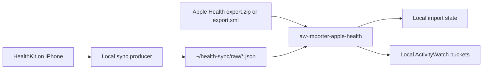

# aw-importer-apple-health

Local-first Apple Health / HealthKit importer for ActivityWatch.

This repo imports selected Apple Health exports (`export.xml`, `.xml.gz`, or the Apple Health export ZIP) and local HealthKit-sync style JSON files into private local ActivityWatch buckets.

## Privacy first

- Keep real Apple Health exports local and out of Git.
- Do not commit raw JSON payloads from iPhone/Mac sync tools.
- Imported ActivityWatch buckets become private health-data storage.
- Use this for personal awareness and trend review only; it is not a medical or diagnostic tool.

The `.gitignore` intentionally blocks common private export names and local sync folders.

## Install for local development

```bash
python3 -m venv .venv
. .venv/bin/activate
pip install -e . pytest ruff
```

The console entrypoint is:

```bash
aw-importer-apple-health --help
```

## CLI commands

### Inspect an Apple Health XML/ZIP export

Parses supported records and prints counts without writing to ActivityWatch:

```bash
aw-importer-apple-health inspect ~/ActivityWatchImports/apple-health/export.zip
```

Supported input forms:

- `export.xml`
- `export.xml.gz`
- Apple Health export ZIP containing an `export.xml` file, including nested paths such as `apple_health_export/export.xml`

### Import an Apple Health XML/ZIP export

Dry-run first:

```bash
aw-importer-apple-health import-export ~/ActivityWatchImports/apple-health/export.zip --dry-run
```

Import into ActivityWatch:

```bash
aw-importer-apple-health import-export ~/ActivityWatchImports/apple-health/export.zip
```

Limit to specific HealthKit identifiers by repeating `--type`:

```bash
aw-importer-apple-health import-export export.xml \
  --type HKQuantityTypeIdentifierStepCount \
  --type HKQuantityTypeIdentifierHeartRate \
  --dry-run
```

Workout imports are selected with either:

```bash
--type Workout
--type workouts
```

### Import one JSON file

```bash
aw-importer-apple-health import-json ~/health-sync/raw/steps.json --dry-run
aw-importer-apple-health import-json ~/health-sync/raw/steps.json
```

If JSON records do not contain a type/metric/name field, pass a fallback type:

```bash
aw-importer-apple-health import-json ~/health-sync/raw/steps.json --type steps --dry-run
```

### Sync a local dropzone folder

```bash
aw-importer-apple-health sync-folder ~/health-sync/raw --dry-run
aw-importer-apple-health sync-folder ~/health-sync/raw
```

`sync-folder` recursively scans JSON/XML/ZIP/GZ files, skips dotfiles and unsupported suffixes, and stores local import state to avoid duplicate imports.

## JSON input shape

`import-json` accepts:

- A list of records
- A single record object
- A wrapper object containing a list under `records`, `data`, `samples`, or `items`

Example:

```json
[
  {
    "type": "steps",
    "value": 42,
    "unit": "count",
    "start": "2026-05-09T08:00:00+02:00",
    "end": "2026-05-09T08:05:00+02:00",
    "source": "iPhone"
  }
]
```

Recognized time fields:

- `start`, `startDate`, `start_time`, `date`
- `end`, `endDate`, `end_time`

Recognized value fields:

- `value`
- `quantity`
- `duration`

Common JSON type aliases include:

- `steps`, `step_count`
- `heart-rate`, `heart_rate`, `resting-heart-rate`, `hrv`
- `sleep`
- `workout`, `workouts`
- `active_energy`, `body_mass`, `weight`
- `blood_glucose`, `blood_oxygen`, `respiratory_rate`, `vo2max`
- `caffeine`, `water`, `protein`, `carbohydrates`, `fat_total`
- `toothbrushing`

Unknown JSON types are still normalized into the `daily` category so dry-runs can expose producer drift.

## Imported ActivityWatch buckets

Records are written to buckets with this prefix:

```text
aw-importer-apple-health-
```

Current categories:

- `aw-importer-apple-health-daily`
- `aw-importer-apple-health-vitals`
- `aw-importer-apple-health-workout`
- `aw-importer-apple-health-sleep`
- `aw-importer-apple-health-mindfulness`
- `aw-importer-apple-health-habits`
- `aw-importer-apple-health-nutrition`

Each ActivityWatch event stores:

- `timestamp`: HealthKit start time
- `duration`: seconds between start and end, clamped to zero if needed
- `data.apple_health_id`: stable per-record ID derived from type/start/end/value/unit
- `data.record`: normalized source record

## Supported Apple Health XML coverage

The XML parser imports a broad but explicit HealthKit subset:

- Activity: steps, walking/running distance, cycling distance, swimming distance, flights climbed, exercise time, stand time, active energy, basal energy, VO2max
- Heart/vitals: heart rate, resting heart rate, walking heart-rate average, HRV SDNN, respiratory rate, oxygen saturation, body temperature, blood pressure systolic/diastolic, blood glucose
- Body: body mass, BMI, body fat percentage, lean body mass, height, waist circumference
- Nutrition/hydration: dietary energy, protein, carbohydrates, total fat, sugar, fiber, water, caffeine
- Sessions/habits: sleep analysis, mindfulness, toothbrushing, handwashing, workouts

Unsupported XML `Record` types are skipped by design.

## Recommended local iPhone → Mac sync flow

Suggested folders:

```text
~/health-sync/raw/                    # iPhone/Mac helper writes JSON here
~/health-sync/normalized/             # optional normalized exports
~/ActivityWatchImports/apple-health/  # manual ZIP/XML fallback backfills
~/Library/Logs/aw-activitywatch-stack/
```

Start with only the four core streams and 30 days of history:

- steps
- sleep
- heart-rate
- workouts

Conceptual flow:

```bash
# Exact producer commands depend on the chosen iPhone/Mac sync tool.
healthsync fetch --type steps --days 30 --out ~/health-sync/raw/steps.json
healthsync fetch --type sleep --days 30 --out ~/health-sync/raw/sleep.json
healthsync fetch --type heart-rate --days 30 --out ~/health-sync/raw/heart-rate.json
healthsync fetch --type workouts --days 30 --out ~/health-sync/raw/workouts.json

# Import side
aw-importer-apple-health sync-folder ~/health-sync/raw --dry-run
aw-importer-apple-health sync-folder ~/health-sync/raw
```



## OpenClaw skill integration

The repo includes an OpenClaw skill at:

```text
skills/apple-health-sync/SKILL.md
```

Use it for local-first Apple Health / HealthKit sync into ActivityWatch. The skill documents the privacy boundary, first-run scope, default folders, scripts, and LaunchAgent template.

Helper scripts:

```bash
scripts/setup-health-sync-folders.sh
scripts/sync-health-folder.sh --dry-run
scripts/sync-health-folder.sh
```

LaunchAgent template:

```text
contrib/launchd/ai.servas.aw-apple-health-sync.plist.template
```

Replace `__HOME__` and `__REPO_DIR__` before loading it, and keep it disabled until the JSON producer is stable.

## Development checks

```bash
.venv/bin/python -m pytest -q
.venv/bin/python -m ruff check .
.venv/bin/python scripts/privacy-check.py
```
